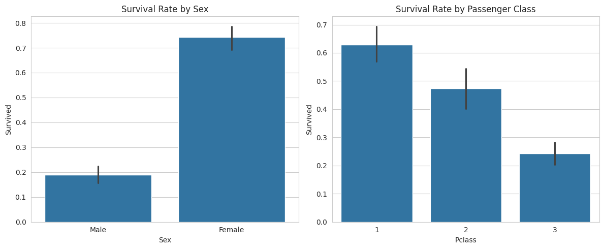
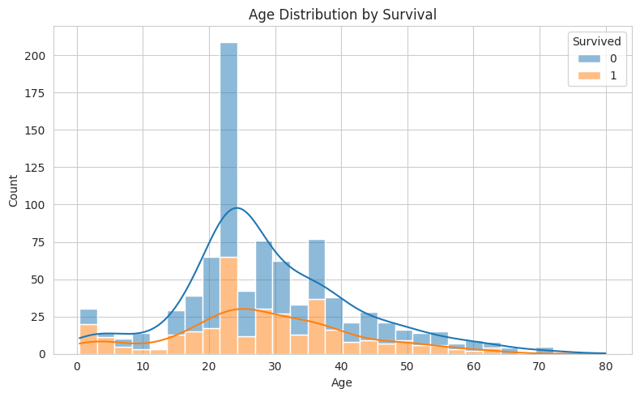
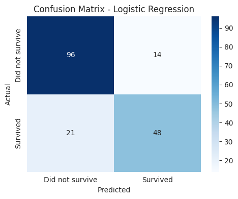
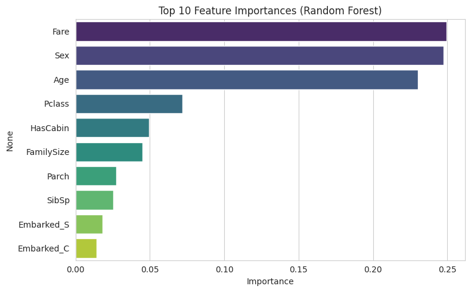

# Titanic Classification

## About
This project was completed as part of my Data Science internship at CodeAlpha.

## Problem Statement
Predict whether a Titanic passenger survived, based on features like age, sex, passenger class, fare, and family size.

## Dataset
Titanic dataset (891 passengers, 12 original features) — includes passenger class, sex, age, fare, cabin, embarkation point, and survival outcome.

## Approach
- Data loading and exploration (checked missing values in Age, Cabin, Embarked)
- Cleaning: filled Age by median-per-class, filled Embarked with mode, converted Cabin to a binary HasCabin feature
- Feature engineering: encoded Sex, one-hot encoded Embarked, created FamilySize and IsAlone features
- Visualization: survival rate by sex and class, age distribution by survival
- Trained and compared Logistic Regression and Random Forest
- Evaluated with accuracy, confusion matrix, and classification report

## Results
- Logistic Regression: 80.45% accuracy
- Random Forest: 80.45% accuracy
- **Sex** and **passenger class** were the strongest predictors of survival

## Tools Used
Python, pandas, scikit-learn, matplotlib, seaborn

## How to Run
1. Clone this repo
2. Install requirements: `pip install -r requirements.txt`
3. Open `notebook/titanic_classification.ipynb` in Jupyter or Google Colab
4. Run all cells

## Video Explanation
[Add your LinkedIn video link here after posting]
